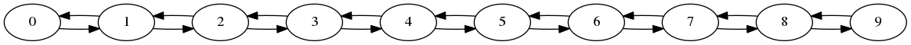
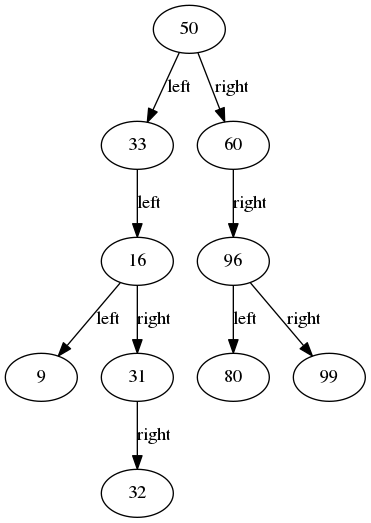
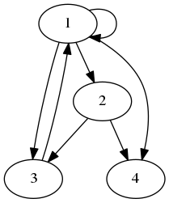

## Visualization Linked-list: **visual-ll** project

* 出發點為希望建構出一個方便於在 C 程式中對於 linked-list 這個抽象的資料結構概念做 debug 時使用的工具
* 於是結合了 `graphviz` 這套工具（各平台都有支援！）
* 透過 linked-list 連接的特性，在印出彼此關係時，把 **鍵結** 以 graphviz 的格式輸出到檔案中
* 再透過 graphviz 的 `dot` 指令把輸出的檔案轉換成對應的圖片；並利用圖像化的模式

## 如何使用 + DEMO

* 設計的方式主要以 **library** 做提供；基本的資料結構定義加上 general-purposed 的 method 作為 library 提供給需要的人做 fork/clone 後自行修改使用；
* 透過 library 內 `print_gv_*` 的 method，可以把目前操作後的 linked-list 結果給輸出
* 可以在專案內 `lib/` 的資料夾中找到目前實作的函式；並且可以看到於專案根目錄中的 `main.c` 中提供**如何操作使用**的範例
* 目前支援：
    * 一般的 linked-list
    
    * 二元樹 binary tree
    
    * 圖 graph
    
* 更詳細內容可以參考下方 `Reference` 中的 `github` 連結！

---
## References

* [visual-ll GitHub](https://github.com/toolbuddy/visual-ll)

---
## Contact

* [Kevin Cyu](https://kevinbird61.github.io/Intro/)